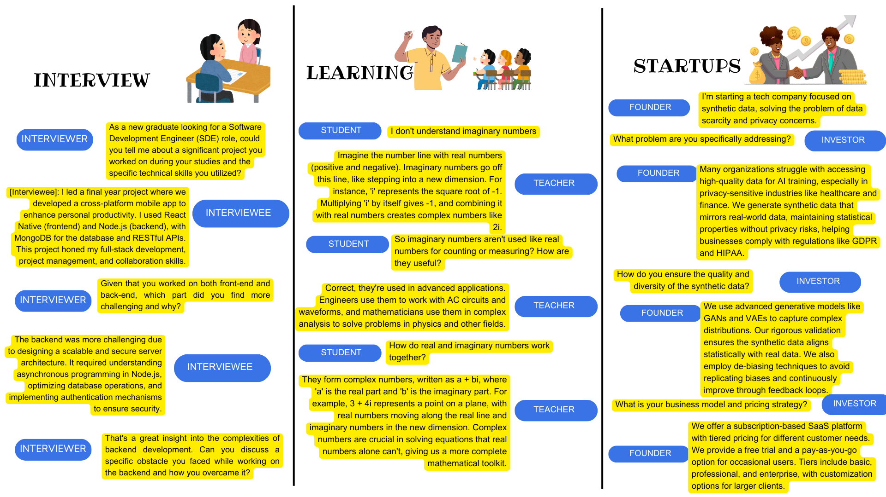

# MultiBot Simulation for Self-Play 🗣️🔄🗣️

SelfPlay is a Python package that allows you to simulate conversations between multiple chatbots. The package includes an orchestrator bot to determine the order of responses based on a given goal. 

Introducing SelfPlay Project – a versatile and intelligent chatbot package designed to enhance your conversational AI capabilities. With features enabling multi-turn self-chat and seamless interaction between two chatbots, this package leverages the power of LLMs to deliver insightful and dynamic conversations. Perfect for developers, educators, and businesses looking to integrate advanced chatbot functionalities, Self-play offers robust logging, error handling, and easy customization to meet your unique needs.

**NEW**: SelfPlay now includes a Gradio-based UI and support for multiple LLM providers including OpenAI, Azure OpenAI, Anthropic, Google, Meta, and AWS Bedrock!


Here's the illustration of two chatbots engaging in self-play, designed to highlight their interaction in a modern tech environment.
## Features

- Simulate conversations among multiple bots
- Orchestrator bot to manage conversation flow
- Provides Memory for LLM conversations
- Multi-turn Conversations with control for maximum turns
- Ability to export conversation as a neatly formatted HTML
- Easy-to-use API
- **NEW**: Gradio-based user interface for easy interaction
- **NEW**: Support for multiple LLM providers:
  - Azure OpenAI
  - OpenAI
  - Anthropic (Claude)
  - Google (Gemini)
  - Meta (Llama)
  - AWS Bedrock

## Installation

You can install the package via pip:

```sh
# Basic installation
pip install selfplay

# With UI support
pip install selfplay[ui]

# With all providers
pip install selfplay[all]

# With specific providers
pip install selfplay[anthropic,google,aws]
```

## Usage

### Example 1: Multi-turn Self Chat with Azure OpenAI

In this example, the chatbot will perform a self-chat to simulate a conversation with itself using Azure OpenAI.

```python
import os
from selfplay.chatbot import Chatbot

# Set Azure OpenAI credentials
os.environ["AZURE_OPENAI_API_KEY"] = "your-api-key"
os.environ["AZURE_OPENAI_API_ENDPOINT"] = "https://your-endpoint.openai.azure.com"
os.environ["AZURE_OPENAI_API_VERSION"] = "2023-12-01-preview"

# Self-chat multi-turn conversation
bot = Chatbot(
    name="default", 
    sys_msg="You are a helpful assistant and honest in responses. You give short and concise responses.",
    provider="azure",  # Using Azure OpenAI
    model="gpt-4"
)
bot.chat("What is the capital of California?")    
bot.chat("How about Oregon?")
bot.chat("How many people live here?")
print(bot)
```

### Example 2: Chat with Another Bot using OpenAI

In this example, two chatbots interact with each other using the OpenAI API.

```python
import os
from selfplay.chatbot import Chatbot

# Set OpenAI credentials
os.environ["OPENAI_API_KEY"] = "your-openai-api-key"

# Initialize chatbots with specific roles and system messages
teacher = Chatbot(
    name="Teacher",
    sys_msg="You are a helpful teacher with extensive knowledge of science and math. "
            "You ask thoughtful questions to motivate and invoke students' curiosity and depth. "
            "Provide concise, crisp, and clear replies.",
    provider="openai",  # Using OpenAI
    model="gpt-4"
)
student = Chatbot(
    name="Student",
    sys_msg="You are a student trying to learn from a teacher. "
            "Ask clarifying questions until the topic is clear to you.",
    provider="openai",  # Using OpenAI
    model="gpt-4"
)

# Interact between the teacher and student chatbots
response = teacher.interact(
    student,  # who to interact with
    start="I'm a 4th grader and I don't seem to quite understand what complex numbers are.",
    num_turns=2,  # max_turns in conversation
    filename="teacher-student.html"  # export the chat results in a well-formatted HTML file
)
print(response)
```

### Example 3: Using Anthropic Claude

```python
import os
from selfplay.chatbot import Chatbot

# Set Anthropic credentials
os.environ["ANTHROPIC_API_KEY"] = "your-anthropic-api-key"

# Create a chatbot using Anthropic Claude
bot = Chatbot(
    name="Claude",
    sys_msg="You are Claude, a helpful and harmless AI assistant.",
    provider="anthropic",
    model="claude-3-opus"
)

response = bot.chat("Tell me about the history of artificial intelligence.")
print(response)
```

### Example 4: Using the Gradio UI

You can launch the Gradio UI to interact with the chatbots through a web interface:

```python
from selfplay.app_gradio import main

# Launch the Gradio app
main()
```

Alternatively, you can use the provided script:

```sh
python run_gradio.py
```

The UI allows you to:
- Select different LLM providers
- Configure API credentials
- Choose between Self-Chat, Bot-to-Bot Chat, and Template-Based Chat
- Customize bot personas and conversation parameters
- View and export conversation results
## Contributing

We welcome contributions to the Selfplay framework! Please read our [CONTRIBUTING.md](CONTRIBUTING.md) for guidelines on how to contribute, including submitting pull requests and reporting issues.

To contribute:

1. Fork the repository
2. Create a new branch (`git checkout -b feature-branch`)
3. Make your changes and commit them (`git commit -am 'Add new feature'`)
4. Push the branch (`git push origin feature-branch`)
5. Submit a pull request

## Issues & Feedback

Found a bug or have a suggestion? Open an issue [here](https://github.com/prdeepakbabu/selfplay/issues) to collaborate on improvements. We actively review and address community feedback.

## Collaboration & Partnerships

We’re open to collaborating with researchers and developers interested in extending Selfplay or integrating it into larger projects. Feel free to reach out via [prdeepak.babu@gmail.com] for discussions regarding joint development or research partnerships.
