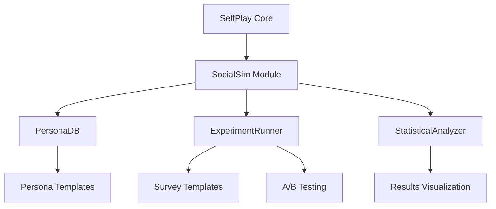

# SocialSim: Social Science Experiment Simulation Extension for SelfPlay

## Overview

SocialSim is a proposed extension to the SelfPlay package that adds capabilities for conducting simulations of social science experiments. The extension will enable researchers, marketers, policy makers, and educators to simulate surveys with large numbers of AI personas, conduct A/B testing, and analyze results with statistical metrics.

## Core Concept

The core concept is to leverage large language models to simulate how diverse personas would respond to survey questions, hypothetical scenarios, and experimental stimuli. This allows for rapid, cost-effective testing of ideas before conducting real-world studies.

Key capabilities include:
- Sampling personas from a persona database with diverse demographic and psychographic attributes
- Asking hypothetical questions (e.g., voting preferences, product opinions, policy support)
- Conducting A/B tests with different question formulations or different persona groups
- Analyzing results with statistical metrics (mean, standard deviation, significance testing)

## Proposed Architecture



### 1. PersonaDB Component

This component will manage a database of personas with various demographic and psychographic attributes:

- **Persona Structure**:
  - Demographic attributes (age, gender, education, income, location, etc.)
  - Psychographic attributes (values, beliefs, personality traits, etc.)
  - Response tendencies (bias patterns, consistency, etc.)

- **Persona Sampling**:
  - Random sampling with configurable parameters
  - Stratified sampling to ensure representation
  - Custom filtering based on attributes

### 2. ExperimentRunner Component

This component will manage the execution of experiments:

- **Survey Management**:
  - Define survey questions and formats
  - Support for different question types (multiple choice, Likert scale, open-ended)
  - Support for conditional questions

- **A/B Testing**:
  - Split testing with control and experimental groups
  - Multi-variant testing

- **Experiment Configuration**:
  - Sample size control (n=X)
  - Randomization controls
  - Bias mitigation techniques

### 3. StatisticalAnalyzer Component

This component will analyze the results of experiments:

- **Basic Statistics**:
  - Mean, median, mode
  - Standard deviation, variance
  - Frequency distributions

- **Inferential Statistics**:
  - t-tests for comparing groups
  - ANOVA for multi-group comparisons
  - Chi-square tests for categorical data
  - Correlation analysis

- **Results Visualization**:
  - Charts and graphs
  - Data tables
  - Summary reports

## Implementation Plan

### Phase 1: Core Infrastructure

1. **Create PersonaDB Module**:
   - Define persona schema
   - Implement storage and retrieval mechanisms
   - Create sampling functions
   - Add initial set of diverse personas

2. **Create Basic ExperimentRunner**:
   - Implement survey question framework
   - Create mechanism to present questions to personas
   - Develop response collection and storage

3. **Create Basic StatisticalAnalyzer**:
   - Implement descriptive statistics functions
   - Create simple visualization capabilities
   - Add data export functionality

### Phase 2: Advanced Features

1. **Enhance PersonaDB**:
   - Add more sophisticated persona attributes
   - Implement more advanced sampling techniques
   - Create persona generation capabilities

2. **Enhance ExperimentRunner**:
   - Add A/B testing framework
   - Implement more complex survey logic
   - Add experiment templates

3. **Enhance StatisticalAnalyzer**:
   - Add more advanced statistical tests
   - Improve visualization capabilities
   - Add significance testing

### Phase 3: Integration and UI

1. **Integrate with Existing SelfPlay UI**:
   - Add experiment configuration tab
   - Create persona management interface
   - Develop results visualization dashboard

2. **Documentation and Examples**:
   - Create comprehensive documentation
   - Develop example experiments
   - Create tutorials

## Package Structure Options

We considered three options for implementing SocialSim:

### Option 1: Integrated Module (Selected Approach)
- Create a `socialsim` module within the existing SelfPlay package
- Pros:
  - Leverages existing SelfPlay infrastructure (LLM providers, conversation management)
  - Easier integration with existing codebase
  - Single installation for users
  - Clear connection between the conversation simulation and social experiments
- Cons:
  - Could make the SelfPlay package larger and more complex
  - May conflate two somewhat different use cases

### Option 2: Separate Package with SelfPlay Dependency
- Create a new package (e.g., `selfplay-socialsim` or `socialsim`) that depends on SelfPlay
- Pros:
  - Cleaner separation of concerns
  - Can evolve independently
  - More focused documentation and examples
- Cons:
  - Additional dependency management
  - Potential version compatibility issues
  - Duplicated code for some functionality

### Option 3: Completely Independent Package
- Create a standalone package with no dependency on SelfPlay
- Pros:
  - Maximum flexibility and independence
  - Can be used by people not interested in the conversation simulation aspects
- Cons:
  - Significant code duplication (LLM provider interfaces, etc.)
  - More maintenance burden
  - Loses the benefits of the existing SelfPlay infrastructure

## A/B Testing Approaches

SocialSim will support two main A/B testing methodologies:

1. **Same Sample, Different Questions** (Question Variation):
   - Present different question formulations to the same persona sample
   - Analyze how framing affects responses
   - Example: "Who will win the game?" vs. "Based on recent performance, who will win the game?"

2. **Different Samples, Same Question** (Sample Variation):
   - Present the same question to different persona groups
   - Analyze how different demographic/psychographic segments respond differently
   - Example: Compare responses between different age groups, education levels, etc.

Both approaches are valuable and serve different research questions. SocialSim will implement both to provide maximum flexibility.

## Real-World Experiment Examples

### 1. Political Science & Public Policy

#### Voting Behavior Simulations
- **Election Outcome Predictions**: Simulate voting intentions across different demographic groups and compare to actual election results
- **Policy Support Analysis**: Measure support for proposed legislation across different constituencies
- **Message Testing**: Test how different political messages resonate with various demographic groups

#### Policy Impact Assessment
- **Simulate public reaction to policy announcements** before they're made
- **Test different framings of the same policy** to see which gains more support
- **Identify potential opposition groups** to specific policies

#### Example Experiment:
```python
experiment = ExperimentRunner(
    question="How likely are you to vote for a candidate who supports [policy]?",
    options=["Very likely", "Somewhat likely", "Neutral", "Somewhat unlikely", "Very unlikely"],
    personas=personas.filter(eligible_voters=True),
    stratify_by=["political_leaning", "age_group", "education"]
)
```

### 2. Market Research & Consumer Behavior

#### Product Concept Testing
- **New Product Ideas**: Gauge initial reactions to product concepts
- **Feature Prioritization**: Determine which features consumers value most
- **Price Sensitivity Analysis**: Test different price points to find optimal pricing

#### Brand Perception Studies
- **Brand Association**: Measure what attributes people associate with different brands
- **Competitive Analysis**: Compare perceptions of competing brands
- **Rebranding Impact**: Test how rebranding efforts might shift perceptions

#### Example Experiment:
```python
experiment = ExperimentRunner.ab_test(
    control_question="Would you purchase this product for $19.99?",
    test_question="Would you purchase this product for $24.99?",
    options=["Definitely yes", "Probably yes", "Might or might not", "Probably not", "Definitely not"],
    personas=personas.filter(income_bracket=["middle", "upper_middle"]),
    n=2000
)
```

### 3. Social Psychology

#### Framing Effect Studies
- **Message Framing**: Test how framing the same information positively vs. negatively affects decisions
- **Loss Aversion**: Measure how people respond differently to potential gains vs. losses
- **Anchoring Effects**: Test how initial information influences subsequent judgments

#### Social Norm Experiments
- **Conformity Studies**: Simulate how people's opinions shift when exposed to group consensus
- **Descriptive vs. Injunctive Norms**: Compare the effectiveness of different types of social norms
- **Cross-Cultural Variations**: Examine how social norms differ across cultural contexts

#### Example Experiment:
```python
# Framing effect study
experiment = ExperimentRunner.ab_test(
    control_question="This treatment has a 70% success rate. Would you recommend it?",
    test_question="This treatment has a 30% failure rate. Would you recommend it?",
    options=["Strongly recommend", "Recommend", "Neutral", "Not recommend", "Strongly not recommend"],
    personas=personas.sample(n=3000)
)
```

### 4. Educational Research

#### Learning Method Effectiveness
- **Pedagogical Approaches**: Compare different teaching methods for various subjects
- **Content Format Testing**: Test how different content formats affect comprehension
- **Feedback Mechanisms**: Evaluate different types of feedback on learning outcomes

#### Student Engagement Studies
- **Motivation Factors**: Identify what motivates students across different demographics
- **Barrier Analysis**: Understand obstacles to educational engagement
- **Intervention Testing**: Evaluate potential interventions to improve engagement

#### Example Experiment:
```python
experiment = ExperimentRunner.multi_variant_test(
    base_question="How likely would you be to complete this online course?",
    variants={
        "video_lectures": "This course features 10 video lectures of 15 minutes each.",
        "interactive": "This course features 10 interactive modules with hands-on exercises.",
        "text_based": "This course features 10 in-depth reading assignments with quizzes.",
        "mixed_format": "This course features a mix of videos, readings, and interactive exercises."
    },
    options=["Very likely", "Somewhat likely", "Neutral", "Somewhat unlikely", "Very unlikely"],
    personas=personas.filter(education_interest=True),
    n=500  # 500 personas per variant
)
```

### 5. Health Communication

#### Health Message Testing
- **Prevention Campaigns**: Test effectiveness of different public health messages
- **Risk Communication**: Evaluate how people understand and respond to health risks
- **Behavior Change Messaging**: Identify most effective approaches to encourage healthy behaviors

#### Treatment Decision-Making
- **Patient Preferences**: Understand how patients weigh different treatment options
- **Information Presentation**: Test how presentation of medical information affects decisions
- **Shared Decision-Making**: Evaluate different approaches to doctor-patient communication

#### Example Experiment:
```python
experiment = ExperimentRunner.ab_test(
    control_question="How likely are you to get vaccinated based on this information: 'The vaccine is 95% effective at preventing serious illness.'?",
    test_question="How likely are you to get vaccinated based on this information: 'Not getting vaccinated increases your risk of serious illness by 20x.'?",
    options=["Definitely will", "Probably will", "Unsure", "Probably won't", "Definitely won't"],
    personas=personas.sample(n=4000, stratify_by=["age", "political_leaning", "education"])
)
```

### 6. User Experience Research

#### Interface Design Testing
- **UI Layout Comparisons**: Test different interface layouts for usability
- **Information Architecture**: Evaluate how users navigate different information structures
- **Accessibility Testing**: Identify potential accessibility issues for different user groups

#### Feature Prioritization
- **User Preferences**: Determine which features users value most
- **Workflow Optimization**: Identify pain points in user workflows
- **Satisfaction Drivers**: Understand what aspects of a product drive user satisfaction

#### Example Experiment:
```python
experiment = ExperimentRunner.multi_variant_test(
    base_question="How easy was it to complete the task with this design?",
    variants={
        "design_a": "[Description of design A with screenshot]",
        "design_b": "[Description of design B with screenshot]",
        "design_c": "[Description of design C with screenshot]"
    },
    options=["Very easy", "Somewhat easy", "Neither easy nor difficult", "Somewhat difficult", "Very difficult"],
    personas=personas.sample(n=300)  # 300 personas per variant
)
```

### 7. Ethical Decision-Making & Moral Psychology

#### Moral Dilemma Studies
- **Trolley Problem Variations**: Test responses to different versions of ethical dilemmas
- **Cultural Differences**: Compare moral reasoning across different cultural backgrounds
- **Professional Ethics**: Examine ethical decision-making in professional contexts

#### Value Prioritization
- **Value Trade-offs**: Understand how people prioritize competing values
- **Contextual Factors**: Identify how context affects moral judgments
- **Generational Differences**: Compare value priorities across age groups

#### Example Experiment:
```python
# Modern version of the trolley problem for autonomous vehicles
experiment = ExperimentRunner(
    question="An autonomous vehicle faces an unavoidable accident. It must choose between: A) Swerving left, which would hit an elderly pedestrian, or B) Swerving right, which would hit a child. Which should it choose?",
    options=["Definitely A", "Probably A", "Cannot decide", "Probably B", "Definitely B"],
    personas=personas.sample(n=5000, stratify_by=["age", "has_children", "cultural_background"])
)
```

### 8. Environmental Psychology & Sustainability

#### Conservation Messaging
- **Message Framing**: Test different ways to frame environmental messages
- **Motivation Factors**: Identify what motivates pro-environmental behavior
- **Barrier Analysis**: Understand obstacles to sustainable practices

#### Policy Support
- **Climate Policy Acceptance**: Measure support for different climate policies
- **Trade-off Willingness**: Assess willingness to accept costs for environmental benefits
- **Local vs. Global Framing**: Compare effectiveness of local vs. global environmental messaging

#### Example Experiment:
```python
experiment = ExperimentRunner.ab_test(
    control_question="Would you support a carbon tax that increases energy costs by 10% but reduces pollution?",
    test_question="Would you support a clean energy investment that increases energy costs by 10% but creates new jobs?",
    options=["Strongly support", "Support", "Neutral", "Oppose", "Strongly oppose"],
    personas=personas.sample(n=3000, stratify_by=["political_leaning", "income_level"])
)
```

### 9. Advanced Experimental Designs

#### Sequential Testing
- Run experiments in sequence, where later questions depend on earlier responses
- Simulate more complex decision trees and user journeys
- Example: Simulating a multi-stage purchase decision process

#### Longitudinal Simulations
- Track how opinions might change over time with exposure to new information
- Simulate information campaigns with multiple touchpoints
- Example: Testing how repeated exposure to messages affects attitude change

#### Multi-factor Experiments
- Test multiple variables simultaneously using factorial designs
- Identify interaction effects between different factors
- Example: Testing how product features, pricing, and messaging interact to affect purchase intent

#### Example Advanced Experiment:
```python
# Multi-factor experiment
experiment = ExperimentRunner.factorial_design(
    base_question="How likely are you to purchase this smartphone?",
    factors={
        "price": ["$499", "$699", "$899"],
        "battery_life": ["24 hours", "36 hours", "48 hours"],
        "camera_quality": ["Good", "Excellent", "Professional"]
    },
    options=["Very likely", "Somewhat likely", "Neutral", "Somewhat unlikely", "Very unlikely"],
    personas=personas.sample(n=5000)
)
```

## Implementation Considerations

To make these experiments realistic and valuable, we should consider:

1. **Persona Fidelity**: Ensuring personas have consistent beliefs, values, and behaviors across questions

2. **Response Consistency**: Building in appropriate levels of noise and variability to simulate real human response patterns

3. **Demographic Representation**: Creating a diverse and representative set of personas that can be sampled appropriately

4. **Validation**: Comparing simulation results with real-world data where available to validate the approach

5. **Ethical Considerations**: Providing guidelines for ethical use of the simulation tool, particularly for sensitive topics

## Data Collection Mechanism

For collecting detailed data from survey simulations, we need a robust data structure that captures all relevant information:

### Survey Results Data Structure

```python
class SurveyResponse:
    def __init__(self):
        # Survey metadata
        self.survey_id = None
        self.survey_name = None
        self.survey_description = None
        self.timestamp = None
        self.experiment_type = None  # "standard", "ab_test", "multi_variant", etc.
        
        # Question data
        self.question_id = None
        self.question_text = None
        self.question_type = None  # "multiple_choice", "likert", "open_ended", etc.
        self.question_options = []  # List of possible options for multiple choice
        self.question_variant = None  # For A/B testing, which variant was shown
        
        # Persona data
        self.persona_id = None
        self.persona_attributes = {}  # All demographic and psychographic attributes
        
        # Response data
        self.response_value = None  # The actual response (option selected, text entered, etc.)
        self.response_time = None  # Simulated response time
        self.confidence_score = None  # How confident the model is in this response
        
        # Experimental grouping
        self.group = None  # "control", "treatment_a", "treatment_b", etc.
        self.condition = None  # Experimental condition if applicable
```

### Results Collection and Storage

We'll implement a `ResultsCollector` class that:

1. Aggregates responses from all personas
2. Provides methods for exporting to various formats (CSV, JSON, pandas DataFrame)
3. Includes metadata about the experiment setup

```python
class ResultsCollector:
    def __init__(self, experiment_config):
        self.experiment_config = experiment_config
        self.responses = []
        self.start_time = None
        self.end_time = None
        
    def add_response(self, response):
        self.responses.append(response)
        
    def get_dataframe(self):
        """Convert responses to pandas DataFrame for analysis"""
        import pandas as pd
        # Implementation to convert responses to DataFrame
        
    def export_csv(self, filepath):
        """Export results to CSV"""
        df = self.get_dataframe()
        df.to_csv(filepath, index=False)
        
    def export_json(self, filepath):
        """Export results to JSON"""
        import json
        with open(filepath, 'w') as f:
            json.dump(self.to_dict(), f, indent=2)
            
    def to_dict(self):
        """Convert all data to dictionary format"""
        return {
            "experiment_config": self.experiment_config,
            "metadata": {
                "start_time": self.start_time,
                "end_time": self.end_time,
                "total_responses": len(self.responses)
            },
            "responses": [r.__dict__ for r in self.responses]
        }
        
    def summary_statistics(self):
        """Generate basic summary statistics"""
        # Implementation for calculating statistics
```

## Persona Dataset Implementation

After evaluating different options for persona data sources, we've decided to use the PersonaHub dataset from Hugging Face for our initial implementation:

### PersonaHub Dataset

- **Source**: [PersonaHub on Hugging Face](https://huggingface.co/datasets/proj-persona/PersonaHub)
- **Size**: 250K personas (200K in "persona" and 50K in "elite_persona")
- **Content**: Text descriptions of diverse personas
- **Advantages**: 
  - Ready-to-use data
  - Rich text descriptions ideal for LLM interactions
  - Large and diverse dataset
  - Easy integration via Hugging Face's datasets library

### PersonaHubDB Implementation

```python
from datasets import load_dataset
import random
import pandas as pd
import json

class PersonaHubDB:
    def __init__(self, use_elite=True, use_standard=True, cache_dir=None):
        """
        Initialize the PersonaHub database.
        
        Args:
            use_elite: Whether to include elite_persona dataset
            use_standard: Whether to include standard persona dataset
            cache_dir: Directory to cache the dataset
        """
        self.personas = []
        
        # Load datasets
        if use_elite:
            elite_dataset = load_dataset("proj-persona/PersonaHub", "elite_persona", cache_dir=cache_dir)
            self._process_dataset(elite_dataset, "elite")
            
        if use_standard:
            standard_dataset = load_dataset("proj-persona/PersonaHub", "persona", cache_dir=cache_dir)
            self._process_dataset(standard_dataset, "standard")
            
        print(f"Loaded {len(self.personas)} personas from PersonaHub")
        
    def _process_dataset(self, dataset, source_type):
        """Process the dataset into our persona format"""
        for item in dataset["train"]:
            persona = self._convert_to_persona(item, source_type)
            if persona:  # Only add if conversion was successful
                self.personas.append(persona)
                
    def _convert_to_persona(self, item, source_type):
        """Convert a dataset item to our Persona format"""
        try:
            persona = Persona()
            
            # Basic identification
            persona.id = f"{source_type}_{len(self.personas)}"
            persona.source = f"personahub_{source_type}"
            
            # Extract the persona description
            persona.description = item.get("instruction", "")
            
            # Extract demographic and psychographic attributes using LLM
            self._extract_attributes(persona)
            
            return persona
        except Exception as e:
            print(f"Error processing persona: {e}")
            return None
    
    def sample(self, n=100, stratify_by=None, filter_by=None):
        """
        Sample n personas from the database.
        
        Args:
            n: Number of personas to sample
            stratify_by: Attribute to stratify by (e.g., "gender", "age")
            filter_by: Dict of attributes to filter by (e.g., {"gender": "female"})
            
        Returns:
            List of sampled personas
        """
        # Implementation for sampling personas
```

### Enhancing PersonaHub Data with LLMs

While PersonaHub provides good text descriptions, we'll extract structured attributes for effective sampling and filtering using LLMs:

```python
def enhance_personas_with_llm(self, personas, provider="azure", model=None):
    """
    Use LLM to extract structured attributes from persona descriptions.
    
    Args:
        personas: List of personas to enhance
        provider: LLM provider to use
        model: Model to use
    """
    from selfplay.provider_interface import get_provider
    
    llm_provider = get_provider(provider, model=model)
    
    for persona in personas:
        prompt = f"""
        Based on the following persona description, extract key demographic and psychographic attributes.
        
        Persona description: "{persona.description}"
        
        Please extract the following attributes in JSON format:
        - age: numeric age or age range
        - gender: "male", "female", "non_binary", or "unknown"
        - education: highest level of education
        - occupation: current or most recent job
        - income_level: "low", "middle", "upper_middle", "high", or "unknown"
        - location: geographic location (city, state, country)
        - personality_traits: key personality characteristics
        - interests: main hobbies and interests
        - political_leaning: "liberal", "moderate", "conservative", or "unknown"
        - values: core values and beliefs
        
        Format as valid JSON.
        """
        
        # Get response from LLM and update persona attributes
```

### Future Persona Data Sources

For future iterations, we've identified several potential data sources to enhance our persona database:

1. **US Census Data**:
   - American Community Survey (ACS)
   - Current Population Survey (CPS)
   - Survey of Income and Program Participation (SIPP)

2. **Census API Integration**:
   - Programmatic access to Census datasets
   - Python libraries like `census`, `censusgeocode`, and `censusdata`

3. **Hybrid Approach**:
   - Start with PersonaHub for rich descriptions
   - Enhance with Census data for statistical validity
   - Use LLMs to ensure coherence and consistency

## ExperimentRunner Implementation

The ExperimentRunner will integrate with the PersonaHubDB to run experiments:

```python
class ExperimentRunner:
    def __init__(self, persona_db):
        """
        Initialize the experiment runner.
        
        Args:
            persona_db: PersonaDB instance
        """
        self.persona_db = persona_db
        self.results_collector = ResultsCollector({})
        
    def run_survey(self, question, options, n=100, stratify_by=None, filter_by=None, provider="azure", model=None):
        """
        Run a survey experiment.
        
        Args:
            question: The question to ask
            options: List of response options
            n: Number of personas to sample
            stratify_by: Attribute to stratify by
            filter_by: Dict of attributes to filter by
            provider: LLM provider to use
            model: Model to use
            
        Returns:
            ResultsCollector with the experiment results
        """
        # Sample personas
        personas = self.persona_db.sample(n=n, stratify_by=stratify_by, filter_by=filter_by)
        
        # Set up experiment config
        experiment_config = {
            "type": "survey",
            "question": question,
            "options": options,
            "n": len(personas),
            "stratify_by": stratify_by,
            "filter_by": filter_by,
            "provider": provider,
            "model": model
        }
        
        # Initialize results collector
        self.results_collector = ResultsCollector(experiment_config)
        
        # Run the experiment with each persona
        # Collect and return results
```

## Next Steps

With these detailed designs in place, our next steps are:

1. **Implementation**:
   - Create the `socialsim` module within the SelfPlay package
   - Implement the `PersonaHubDB` class
   - Implement the `ExperimentRunner` and `ResultsCollector` classes
   - Add LLM-based attribute extraction for personas

2. **Testing**:
   - Create simple example experiments
   - Validate persona sampling and filtering
   - Test A/B testing functionality
   - Verify statistical analysis

3. **Enhancements**:
   - Improve attribute extraction from persona descriptions
   - Add more sophisticated statistical analysis
   - Explore Census data integration for future iterations
   - Develop visualization capabilities

4. **Documentation**:
   - Create comprehensive API documentation
   - Develop example notebooks
   - Write tutorials for common use cases
